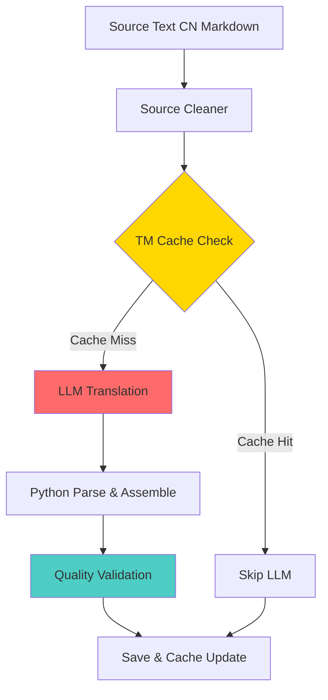

<div align="center">

# 🦀 NovelClaw

### *Production-grade cross-language web novel translation pipeline*

[](https://github.com/ChokechaiXD/NovelClaw)
[](https://www.python.org/)
[](https://nodejs.org/)
[](LICENSE)
[](#test-suite)

**Translate Chinese web novels to Thai at scale** — combining LLM translation, quality scoring, glossary management, translation memory, and a premium dark-theme reader.

[Features](#-features) •
[Quick Start](#-quick-start) •
[Architecture](#-architecture) •
[CLI Reference](#-cli-reference) •
[Contributing](#-contributing)

</div>

---

## 🎯 What is NovelClaw?

NovelClaw is a **complete translation system** for web novels, designed to maintain author voice while scaling to 1,000+ chapters.

| Component | Description |
|-----------|-------------|
| **Translation Pipeline** | LLM-powered translation with glossary context, translation memory cache, quality scoring, and resume support |
| **Web Reader** | Premium dark-theme SPA (vanilla JS, no framework) with responsive mobile-first design |
| **Glossary System** | 3-tier glossary (locked → reference → auto) with 1,000+ term tracking |
| **Quality Gate** | 8-dimension objective scorer to catch mistranslations, hallucinations, and style drift |

### Built on the *Transmittor Principle*
> Preserve the author's voice. Enforce mechanical purity. No framework lock-in.

---

## ✨ Features

### Translation Pipeline
- 🔄 **Translation Memory** — Block-level cache (exact + fuzzy matching) to skip redundant LLM calls
- 📊 **Quality Scoring** — 8-dimension objective scorer (0-100) across completeness, accuracy, fluency, style, tone, CJK leakage, bracket consistency
- 📚 **Tiered Glossary** — 3-tier system: locked (authoritative) → reference (verified) → auto (discovered)
- 🔁 **Resume Support** — Interrupt and resume batch jobs without losing progress
- ⚡ **Concurrent Translation** — Process up to 5 chapters in parallel
- 🎯 **Source Profile** — Adapt prompt/glossary per source (Qidian, JJWXC, 17K, etc.)

### Web Reader
- 🌙 **Dark Theme First** — 4 themes: dark (default), light, sepia, ocean
- 📱 **Mobile-First** — Sidebar collapses, reading mode optimized for all screens
- 🔍 **Chapter Search** — Find by number or title
- 📖 **Smart Pagination** — Range buttons (1-100, 101-200…) for easy navigation
- 🎨 **Pure Vanilla** — No React, no framework, no build step. One ES module per page.
- ⚙️ **Admin Dashboard** — Novel management, chapter table, glossary editor

---

## 🚀 Quick Start

### Prerequisites
- **Python 3.12+** (with bundled venv at `.venv312/`)
- **Node.js 20+**

### Installation

**1. Clone the repo**
```bash
git clone https://github.com/ChokechaiXD/NovelClaw.git
cd NovelClaw
```

**2. Install Python dependencies**
```bash
pip install -e .[test]
```

**3. Install Node dependencies (for reader)**
```bash
cd reader
npm install
```

### Usage

**Translate a single chapter**
```bash
python tools/translate.py 139 --score --json
```

**Batch translate with resume**
```bash
python tools/translate.py 140-190 --resume --concurrent 3 --json
```

**Start the web reader**
```bash
cd reader && node server.js
# → http://localhost:4173
```

**Run tests**
```bash
# Python tests (pytest)
.venv312/Scripts/python.exe -m pytest tests/

# Reader tests (jest)
cd reader && npm test
```

---

## 🏗️ Architecture

```
novelclaw/
│
├── novels/{slug}/              # Novel data (chapters, glossary, sources)
│   ├── chapters/               # Translated chapters (NNNN.json)
│   ├── source/                 # Raw source chapters (CN markdown)
│   ├── glossary/               # 3-tier glossary (locked/reference/auto.md)
│   └── novel.json              # Novel metadata
│
├── tools/                      # Python translation toolkit
│   ├── novelclaw.py            # Main CLI entry point
│   ├── schema.py               # Pydantic JSON schema (Chapter model)
│   ├── validation.py           # CJK/EN/completeness validation gates
│   ├── glossary.py             # Glossary YAML loader (cached LRU)
│   ├── translation_memory.py   # Block-level cache (exact + fuzzy)
│   ├── progress.py             # Resume progress tracking
│   ├── providers/              # LLM provider abstraction (direct HTTP)
│   ├── scorer.py               # 8-dimension objective quality scorer
│   ├── glossary_discovery.py   # Auto-discover character names from text
│   └── import_adapters/        # Source scrapers (Qidian, JJWXC, 17K)
│
├── reader/                     # Web reader (Node.js / Express)
│   ├── server.js               # Backend API + chapter rendering
│   ├── public/                 # Frontend (ITCSS + BEM + Vanilla JS)
│   │   ├── styles/             # ITCSS 5-layer architecture
│   │   │   ├── 01-tokens.css   # Design tokens (colors, type, spacing)
│   │   │   ├── 02-generic.css  # Reset & normalize
│   │   │   ├── 03-elements.css # HTML element defaults
│   │   │   ├── 04-components.css # BEM component classes
│   │   │   └── 05-utilities.css  # Utility classes
│   │   ├── js/                 # ES module pages
│   │   │   ├── app.js          # Router + theme sync
│   │   │   ├── state.js        # Observer-pattern store
│   │   │   ├── api.js          # Fetch + cache layer
│   │   │   ├── components.js   # Shared UI components
│   │   │   └── pages/          # Page modules (home, novel, reader, admin)
│   │   └── index.html          # Clean SPA shell
│   ├── lib/                    # Reader utilities
│   └── services/               # Validation, rendering
│
├── tests/                      # 293 tests (pytest + jest)
├── docs/                       # Documentation
├── pyproject.toml              # Python package config
└── README.md                   # This file
```

---

## 🔄 Translation Pipeline



### Pipeline Stages

| Stage | Module | Description |
|-------|--------|-------------|
| **1. Source Cleaning** | `validation.py` | Strip CJK artifacts, normalize line endings |
| **2. TM Cache Check** | `translation_memory.py` | Source hash match → skip LLM / Cache miss → call LLM |
| **3. LLM Translation** | `providers/*.py` | Multi-provider support (OpenAI, Anthropic, OpenRouter) |
| **4. Parse & Assemble** | `schema.py` | Pydantic validation, CN strip, bracket normalization |
| **5. Quality Validation** | `scorer.py` + `validation.py` | 8-dimension scorer + CJK/EN/completeness gates |
| **6. Save & Cache** | `translation_memory.py` | Update TM cache, save `NNNN.json` |

---

## 🎨 Reader UI

The web reader is a **pure-vanilla SPA** — no React, no framework, no build step.

### Tech Stack

| Layer | Technology | Why |
|-------|------------|-----|
| **CSS Architecture** | ITCSS + BEM | Low specificity, no cascade surprises, 0 regressions |
| **JavaScript** | Vanilla ES Modules | No framework lock-in, render speed scales with browser |
| **State Management** | Observer Pattern | Single source of truth, no Redux, no reactivity lib |
| **Chapter Format** | Pydantic-validated JSON | Type-safe, drift-proof, replaces regex-parsed Markdown |
| **Styling** | CSS Custom Properties | 4 themes with one token swap |

### Themes

<div align="center">

| 🌙 Dark (Default) | ☀️ Light | 📜 Sepia | 🌊 Ocean |
|:-:|:-:|:-:|:-:|
| Soft blacks, warm accents | High contrast, crisp whites | Warm cream, vintage | Deep blue, calm greens |

</div>

---

## 📖 CLI Reference

### Main Commands

```bash
# Translate commands
python novelclaw.py translate <chapter> [--score] [--json] [--tm]
python novelclaw.py batch <start>-<end> [--concurrent N] [--resume]

# Glossary management
python novelclaw.py glossary --novel <slug> --load
python novelclaw.py glossary --discover --source <path>

# Quality scoring
python novelclaw.py score <chapter> [--source <path>]

# Translation memory
python novelclaw.py tm build    # Build cache from existing translations
python novelclaw.py tm stats    # Show cache statistics
python novelclaw.py tm lookup <text>  # Search cache by source text

# Import from sources
python novelclaw.py scrape --url <url> --novel <slug>
```

### Common Flags

| Flag | Description |
|------|-------------|
| `--score` | Run quality scorer after translation (0-100 score) |
| `--json` | Output chapter as JSON (Pydantic-validated) |
| `--tm` | Enable translation memory cache |
| `--resume` | Resume interrupted batch from progress file |
| `--concurrent N` | Translate N chapters in parallel (max 5) |
| `--provider <name>` | Override default LLM provider |

---

## 🧪 Test Suite

```
Module Coverage: 10/10 (100%)
Python (pytest):  293 tests  ─ ─ ─  ~2s total
Node (jest):  20+ tests (reader)
```

All **pure-function tests** — no LLM calls, no network, no Playwright.

### Test Modules

| Module | Tests | Focus |
|--------|-------|-------|
| `test_schema.py` | 16 | Chapter schema validation (Pydantic) |
| `test_validation.py` | 11 | CJK/EN/artifact leakage detection |
| `test_translation_memory.py` | 26 | Exact + fuzzy cache behavior |
| `test_glossary.py` | 9 | Save/load roundtrip, tier priority |
| `test_scorer.py` | 18 | 8-dimension quality scoring |
| `test_prompt_builder.py` | 12 | Prompt assembly + glossary injection |
| `test_progress.py` | 9 | Resume tracking |
| `test_frontend.py` | 4 | HTTP smoke tests (no Playwright) |
| `test_edge_cases.py` | 23 | Real chapter validation |

---

## 🏛️ Design Decisions

| Decision | Rationale |
|----------|-----------|
| **ITCSS + BEM** | Proven CSS architecture (Harry Roberts / NHS / Google). Low specificity, no cascade surprises. |
| **Vanilla JS SPA** | No framework lock-in. One ES module per page. Render speed scales with browser, not framework overhead. |
| **Observer State** | Single `settings.theme` source of truth — subscribe anywhere. No Redux, no reactivity library. |
| **JSON Chapter Schema** | Pydantic-validated. Replaces regex-parsed Markdown. Type-safe, drift-proof. |
| **Lazy Imports** | Heavy modules (scorer, glossary discovery) imported on first use, not at startup. |
| **Glossary as YAML** | Git-trackable, human-mergeable. One `glossary.yml` per novel, built from tiered Markdown. |
| **Translation Memory** | Block-level cache (exact + fuzzy) to avoid redundant LLM calls. Saves 30-60% API cost on retranslations. |

---

## 📚 Glossary System

NovelClaw uses a **3-tier glossary** system to handle translation consistency across 1,000+ chapters.

```
novels/{slug}/glossary/
├── locked.md       →  Priority 1 — Authoritative (manually curated)
├── reference.md    →  Priority 2 — Verified (project canonical)
└── auto.md         →  Priority 3 — Auto-discovered (candidates)
```

### Tier Priority

- **Locked** terms override everything (character names, key concepts)
- **Reference** terms are verified but can be challenged
- **Auto** terms are candidates that may be generic or ambiguous

Glossary is compiled to `glossary.yml` on first load and cached (LRU).

---

## 🤝 Contributing

This is a personal project, but contributions are welcome!

### How to Contribute

1. **Fork the repo** and create a branch prefixed with your username
2. **Make your changes** — keep translations mechanically pure and the reader framework-free
3. **Run tests** — ensure all tests pass before submitting
4. **Open a PR** — describe what you changed and why

### Contribution Guidelines

- Keep the reader **framework-free** (no React, no Vue, no build step)
- Follow **ITCSS + BEM** for CSS changes
- Write **pure-function tests** — no LLM calls, no network, no Playwright
- Keep **glossary tiers** separate — don't promote auto → reference without verification
- Maintain **mechanical purity** — preserve author voice, no creative embellishment

---

## 📝 License

MIT © [Chokechai](https://github.com/ChokechaiXD)

See [LICENSE](LICENSE) for details.

---

## 🙏 Acknowledgments

- Built with Python, Node.js, and love for web novels
- Inspired by the need for high-quality Chinese → Thai translations
- Architecture principles from Harry Roberts (ITCSS), BEM methodology, and Pydantic validation

---

<div align="center">

**Made with 🦀 by [Chokechai](https://github.com/ChokechaiXD)**

[⬆ Back to Top](#-novelclaw)

</div>
